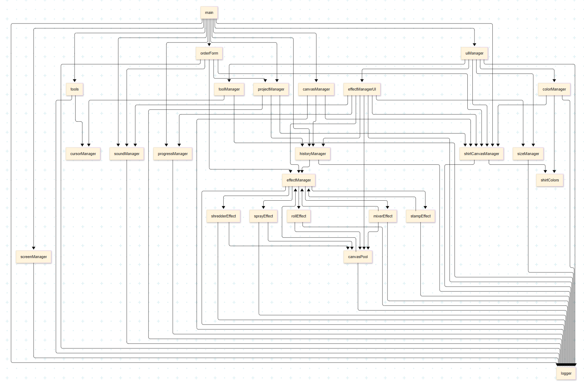

# T-Shirt Designer

**Semester project (B0B39KAJ)** — browser-based t-shirt graphics designer.

**Demo:** https://vladimirzubkov.github.io/sem-kaj-tshirt_designer/

| | |
|---|---|
| **Stack** | Vanilla JavaScript, HTML5 Canvas, CSS, jsPDF |
| **Features** | Drawing tools, image upload (SVG/PNG/GIF/JPG), transfer effects (stamp, spray, roll, mixer, shredder), undo/redo, JSON project save/load, PDF export |
| **Run locally** | Open `index.html` in a browser or serve the folder with any static file server |

---

# T-Shirt Designer: Semestrální práce pro B0B39KAJ

## Téma

Návrh grafiky pro trička online.

## Popis nápadu projektu

Vytvořit webovou stránku pro online návrh trička s možností:

- Nahrávání SVG a rastrových obrázků.
- Základní kreslení.
- Vkládání textu.
- Uložení stavu a pokračování v práci.
- Odeslání nebo stažení výsledku.

## Rozhraní

- Plátno vlevo, zobrazení trička vpravo, menu s nástroji dole.
- Nástroje: Text, výběr barvy, štětec, tužka, guma, voda.
- Proces: Kreslíme na plátno, poté přeneseme na tričko pomocí efektů (razítko, rozprašovač, válec, míchačka, šreder).
- Výstup: Stáhnout PDF, odeslat e-mailem, uložit/načíst projekt jako JSON, odeslat objednávku s PDF.

## Implementované funkce

- **Výběr barvy**:
  - Uživatel může vybrat barvu prostřednictvím `<input type="color">` pro kreslení, která se dynamicky aplikuje na nástroje tužka, štětec a text. Barva je aktualizována v reálném čase při změně výběru nebo přepnutí nástroje. Nástroje guma a voda nejsou ovlivněny výběrem barvy.
  - Samostatný `<input type="color">` pro výběr barvy pozadí trička (transparentní, bílá, šedá, vlastní). Výchozí barva vlastního pozadí je `#E22222`, s možností uložení vybrané barvy pro každý fasón (mužský, ženský, dětský).
  - Výběr barvy trička a pozadí je implementován pomocí dynamicky generovaných kruhových prvků (`.color-circle`) s interaktivními klikacími událostmi, které aktualizují barvu v reálném čase.
  - **Vlastní barvy nástrojů**: Každý nástroj (tužka, štětec, text) má vlastní barvu, která se ukládá nezávisle. Při přepnutí nástroje se automaticky načítá jeho poslední použitá barva, což umožňuje uživateli rychle pokračovat v práci s preferovanými barvami.

- **Čištění plátna**: Tlačítko "Clear" vymaže obsah plátna a resetuje jeho původní stav, s uložením akce do historie. Zároveň vymaže obrázek s klíčem "tshirtDesignPNG" z lokálního umístění (storage). 

- **Tlačítko "Remember and Save Design"** uloží obsah plátna pro kreslení do PNG souboru v lokálním storage s klíčem "tshirtDesignPNG", a rovněž ho stáhne (viz. dále).

- **Výběr nástrojů**: Nástroje (tužka, štětec, text, guma, voda) jsou identifikovány pomocí atributů `data-tool`, což zajišťuje spolehlivé přepínání. Aktuální nástroj je zvýrazněn zvětšenou ikonou a oranžovým rámečkem.

- **Výběr velikosti nástrojů**:
  
  - Posuvník (`<input type="range">`) s rozsahem 1–300 px (výchozí 10 px) nastavuje velikost nástrojů. Velikost se aplikuje na šířku čáry (tužka, štětec, guma), velikost písma (text) nebo poloměr rozmazání (voda).
  - Aktuální velikost je zobrazena nad posuvníkem, přesně sleduje pozici ukazatele, s inicializací a popisky "1px" a "300px".
  - **Vlastní velikosti nástrojů**: Každý nástroj (tužka, štětec, text, guma, voda) má vlastní uloženou velikost, která se nezávisle ukládá a načítá při přepnutí nástroje. To umožňuje uživateli mít například menší velikost pro tužku (např. 10 px) a větší pro štětec (např. 35 px) bez nutnosti opakovaného nastavování.
  
- **Popisky nástrojů**: Popisky ("Pencil", "Brush", "Text", "Water", "Eraser") pod nástroji jsou generovány dynamicky z `tools.js`, zvyšují srozumitelnost rozhraní.

- **Vylepšené uživatelské rozhraní**:
  - Ikona nástroje Text je výrazný symbol "𝐓".
  - Popisky "Color" a "Brush Size" jsou zarovnány s popisky nástrojů, všechny kontejnery mají jednotnou výšku 76px.
  - Prvky ovládání (posuvník, výběr barvy) jsou v samostatných kontejnerech (`.control-element`, `.control-label`) pro flexibilní stylování.
  - Tlačítka efektů (razítko, rozprašovač, válec, míchačka, šreder) jsou horizontálně centrovaná, tlačítka "Save" a "Clear" jsou vertikálně zarovnána v horizontálním řádku s textovým zalomením.
  - Kontejner trička (`.shirt-container`) má šířku 65% rodiče, výšku 300px, je centrovaný s flex zobrazením.
  - Color picker pro pozadí má výrazný oranžový puntíkovaný rámeček (2px dashed #ff4500) s efektem při najetí (#ffa500).

- **Zobrazení kurzoru nástrojů**:
  - Kreslicí nástroje mají kruhový kurzor odpovídající velikosti nástroje, textový nástroj má svislou čáru s výstupky.
  - Kurzor je červený při velikosti 128 px a více, jinak černý, aktualizuje se dynamicky při změně velikosti.

- **Nahrávání obrázků na plátno**:
  - Drag-and-drop pro SVG, PNG, GIF, JPG obrázky. Menší obrázky se zobrazují v místě přetažení, větší se škálují a centrovány.
  - Plátno je při přetahování zvýrazněno modrým rámečkem a světle modrým pozadím.

- **Historie akcí (Undo/Redo)**:
  - Podpora Undo (Ctrl+Z) a Redo (Ctrl+Y), synchronizovaná s historií prohlížeče.
  - Akce (kreslení, text, obrázky, čištění, přenos na tričko) jsou ukládány s popisy (např. "Draw with Pencil", "Transfer Design to Shirt").
  - Historie je optimalizována proti duplicitním stavům (100ms časový filtr) a rychlým efektům (1s filtr).

- **Výběr fasónu a barev trička**:
  - Podpora výběru fasónu (mužský, ženský, dětský) s dynamickým přepínáním v `shirtCanvasManager.js`.
  - Výběr barev trička podle fasónu definovaných v `shirtColors.js`, s automatickou inicializací při načtení stránky.
  - Výběr barvy pozadí (transparentní, bílá, šedá, vlastní) s persistentním ukládáním vlastní barvy (`customBackgroundColor`) pro každý fasón.

- **Přenos návrhu na tričko**:
  - Přenos návrhu z plátna (375x500 px) na tričko (213x284 px) pomocí efektů:
    - **Razítko**: Přímý přenos návrhu s doprovodným zvukem `stamp.mp3`, přidává na stávající obsah.
    - **Rozprašovač**: Přidává 25 kapek každých 0,1 s (poloměr 1–5 px) na neprůhledné části, max. 5000 kapek za 20 s, s doprovodným zvukem `spray.mp3`.
    - **Válec**: Dvě vrstvy s 50% průhledností a 2% zkreslením (mřížka 10x10), druhá po 1 s, s doprovodným zvukem `roll.mp3`.
    - **Míchačka**: Až 5 deformací (merge, twistCW, twistCCW, inflate, deflate, gridWarp) po 1 s, s přerušením a zvukem `mixer.mp3`.
    - **Šreder**: Až 7 kroků rozřezávání (5x5 až 7x7 fragmentů) po 1 s, s rotací a deformací, s doprovodným zvukem `shredder.mp3`.
  - Zvuky efektů přehrávají se při stisknutí tlačítka efektu (`mousedown`) a zastavují se při uvolnění (`mouseup`) nebo opuštění tlačítka (`mouseleave`), implementováno v `effectManagerUI.js` a `soundManager.js`.
  - Efekty jsou ukládány do historie pouze po dokončení nebo přerušení (kromě razítka).
  - Optimalizováno pomocí `canvasPool.js` pro opětovné použití pláten.
  
- **Uložení a načítání návrhu**:
  - Ukládání projektu do JSON přes tlačítko "Save Project", načítání z JSON přes "Load Project".
  - JSON obsahuje design hlavního plátna (`drawCanvas`) a data začatých fasónů (velikost, barva trička, barva pozadí, vlastní barva pozadí, design trička). Prázdné fasóny se neukládají.
  - Při ukládání je možné zadat název souboru, při nevyplnění se použije formát `t-shirt-design-yymmdd-hh-mm.json`.
  - Ukládání designu jako PNG z plátna pro kreslení (`drawCanvas`) do localStorage pod klíčem `tshirtDesignPNG` přes tlačítko "Remember and Save Design". Při načtení stránky se PNG načítá zpět na plátno pro kreslení, což umožňuje pokračovat v úpravách. Tento obrázek se rovněž stáhne v okamžik ukládání do počítače. 
  
- **Export do PDF a odeslání e-mailem**:
  
  - **Export do PDF**: Tlačítko "Download PDF" exportuje návrhy všech neprázdných fasónů do PDF (A3 formát) přes `jsPDF` s doprovodným zvukem `stapler.mp3`. Každý fasón má samostatnou stránku s textem (styl, velikost, barvy), náhledy barev, škálovaným obrazem trička, typografickými značkami a měřítkem.
  - **Forma objednávky**: Tlačítko "Order T-Shirts" otevírá formulář s doprovodným zvukem `cashier.mp3`, který dynamicky zobrazuje pouze fasóny s neprázdnými designy. Uživatel zadá email a množství pro každý fasón a velikost. Při odeslání (`submit`) se generují PDF pro každý fasón (Data URL) s doprovodným zvukem `hooray.mp3` a ukládají do `orderData.designs`, spolu s emailem a množstvím. Při zrušení formuláře tlačítkem `Cancel` se přehraje `booo.mp3`, při tlačítku `Close` (při prázdném designu) se přehraje `huh.mp3`. Data jsou logována do konzole, simulujíc odeslání na server.
  
- **Zvukové efekty**:
  - Implementovány zvukové efekty v `soundManager.js` pro interaktivní akce:
    - Přepínač zvuku (`sound-toggle-input`): Při zapnutí hraje `yes.mp3`, při vypnutí `no.mp3`, s persistentním ukládáním stavu do `localStorage`.
    - Tlačítko "New Shirt": Přehraje `void.mp3` při vytvoření nového trička.
    - Efekty přenosu návrhu na tričko (`effectManagerUI.js`): `stamp.mp3` pro razítko, `spray.mp3` pro rozprašovač, `roll.mp3` pro válec, `mixer.mp3` pro míchačku, `shredder.mp3` pro šreder. Zvuky se přehrávají při stisknutí (`mousedown`) a zastavují při uvolnění (`mouseup`) nebo opuštění tlačítka (`mouseleave`).
  - Zvuky jsou spravovány v `soundManager.js` s přednačítáním (`new Audio`), zastavováním předchozího zvuku (`stopCurrentSound`) a logováním chyb načítání nebo přehrávání.
  - Všechny zvukové soubory (`yes.mp3`, `no.mp3`, `void.mp3`, `stamp.mp3`, `spray.mp3`, `roll.mp3`, `mixer.mp3`, `shredder.mp3`, `stapler.mp3`, `cashier.mp3`, `hooray.mp3`, `booo.mp3`, `huh.mp3`) jsou uloženy v `assets/` a mají formát MP3.
  
- **Struktura kódu**:
  - **JavaScript**: Rozděleno do modulů:
    - `main.js`: Hlavní logika a inicializace.
    - `tools.js`: Třídy nástrojů (`Tool`, `Pencil`, `Brush`, `Eraser`, `Water`, `TextTool`).
    - `cursorManager.js`: Generování kurzorů.
    - `historyManager.js`: Správa historie akcí.
    - `effectManager.js`, `stampEffect.js`, `sprayEffect.js`, `rollEffect.js`, `mixerEffect.js`, `shredderEffect.js`: Logika efektů.
    - `progressManager.js`: Zobrazení průběhu efektů.
    - `projectManager.js`: Ukládání, načítání, export PDF, e-mail, JSON projekty.
    - `canvasManager.js`: Zpracování událostí plátna.
    - `toolManager.js`, `colorManager.js`, `sizeManager.js`, `effectManagerUI.js`, `canvasPool.js`, `shirtCanvasManager.js`, `orderForm.js`, `soundManager.js`: Modulární UI logika.
    - `logger.js`: Podmíněné logování.
    - `shirtColors.js`: Definice barev triček.
  - **Použité knihovny a frameworky**:
    - **jsPDF**: Jediná externí knihovna použitá v projektu, slouží k generování PDF souborů pro export návrhů triček (např. `shirt-designs.pdf`). Umožňuje vytvářet vícestránkové dokumenty s textem, obrázky a typografickými prvky.
    - Projekt nepoužívá žádné další frameworky jako jQuery, React nebo Vue, spoléhá se na vanilla JavaScript pro zajištění maximální kontroly a optimalizace.
  - **Kontext `ctx`**: Zkratka pro "context", odkazuje na 2D renderingový kontext HTML5 Canvas (`CanvasRenderingContext2D`), získaný metodou `canvas.getContext('2d')`. Používá se pro všechny kreslicí operace na plátnech `drawCanvas` a `shirtCanvas`, např. pro kreslení čar, textu nebo aplikaci efektů.
  - **CSS**: Rozděleno do `base.css`, `layout.css`, `components.css`, `shirt.css` pro lepší organizaci, připojeno přes `<link>` v `index.html`.

	Vztah javascriptových modulů:
	
    

## Plánované funkce

- Implementace skutečného 3D modelu trička (např. pomocí Three.js).
- Vylepšení správy barev triček v `shirtColors.js` pro opravu nesprávných barev a zajištění nezávislosti ukládání na změny barev.
- Rozšíření funkcionality tlačítka "Remember and Save Design" pro další možnosti ukládání.

## Historie změn

- **Vylepšení grafických prvků a nástrojů**:
  - Upraven nástroj `Brush` v `tools.js`: Zvýšena průhlednost na 50%, rozmazání na 4px, odstraněn efekt `multiply` a nahrazen standardním `source-over` pro lepší vizuální kvalitu. Přidáno obnovení `globalAlpha` a `filter` v `onMouseUp` pro prevenci ovlivnění jiných nástrojů.
  - Implementovány **vlastní velikosti a barvy nástrojů**: Každý nástroj (tužka, štětec, text, guma, voda) má nyní nezávisle uloženou velikost a barvu (pro tužku, štětec a text), které se automaticky načtou při přepnutí nástroje, což zlepšuje uživatelskou zkušenost a flexibilitu při kreslení.
  - Upraven nástroj `Voda` v `tools.js`: Nyní simuluje efekt stírání designu na tričku (`shirtCanvas`) až do úplné průhlednosti, což umožňuje uživateli "vymazat" design a začít znovu bez resetu celého plátna.
  - Aktualizován `README.md` s popisem nových funkcí, včetně vlastních velikostí a barev nástrojů a efektu stírání trička.

- **Navigace mezi obrazovkami a zvukové efekty**:
  - Upraven `index.html` pro zahrnutí obrazovek Nastavení a O aplikaci.
  - Aktualizován `layout.css` pro přechody mezi obrazovkami a správu viditelnosti.
  - Přidán `screenManager.js` pro logiku přepínání obrazovek.
  - Aktualizován `main.js` pro inicializaci navigace mezi obrazovkami a přidání zvuku `void.mp3` pro tlačítko "New Shirt", odstranění zvuku z tlačítka "Clear".
  - Aktualizován `soundManager.js` pro implementaci zvukových efektů: `yes.mp3` při zapnutí zvuku, `no.mp3` při vypnutí, podpora zastavování zvuků efektů (`stopCurrentSound`), přidán zvuk `stamp.mp3` pro efekt razítka.
  - Aktualizován `effectManagerUI.js` pro přehrávání zvuků efektů (`stamp.mp3`, `spray.mp3`, `roll.mp3`, `mixer.mp3`, `shredder.mp3`) při stisknutí tlačítka a zastavování při uvolnění.
  - Aktualizován `orderForm.js` pro rozlišení zvuků: `huh.mp3` pro tlačítko `Close` (při prázdném designu) a kliknutí mimo formulář, `booo.mp3` pro tlačítko `Cancel`.
  - Aktualizován `README.md` s popisem nových funkcí, včetně zvukových efektů a navigace.

- **Počáteční ladění a optimalizace**:
  - Centralizována správa událostí myši v `canvasManager.js`, přidáno logování pro nástroje a plátno.
  - Nahrazeno `console.log` podmíněným logováním v `logger.js` s úrovněmi `debug`, `info`, `warn`, `error`.

- **Modularizace a optimalizace kódu**:
  - Vytvořena třída `DrawingTool` v `tools.js` pro snížení duplicity kódu.
  - Sloučeny `exportManager.js` a `projectManager.js` do `projectManager.js` s vylepšeným exportem PDF.
  - Přidány utility `createOptimizedContext`, `countNonZeroPixels`, `isCanvasEmpty` v `effectManager.js`.
  - Rozdělena `uiManager.js` do modulů (`toolManager.js`, `colorManager.js`, apod.) pro lepší údržbu.

- **Vylepšení plátna a efektů**:
  - Nahrazeny přímé reference na `shirtCanvas` voláním `getCurrentShirtCanvas` z `shirtCanvasManager.js`.
  - Přidán `canvasPool.js` pro opětovné použití pláten, optimalizující paměť.
  - Zamezeno vícenásobným aplikacím efektů pomocí `isEffectActive` a asynchronního `transferDesignToShirt`.
  - Přidán typ `gridWarp` do `mixerEffect.js`, zajištěna sekvenční aplikace deformací a ukládání při přerušení.

- **Vylepšení barev a rozhraní**:
  - Rozdělen `style.css` na `base.css`, `layout.css`, `components.css`, `shirt.css`, přidána třída `debug-border`.
  - Implementován výběr barev trička a pozadí v `colorManager.js`, s persistentními barvami pro každý fasón.
  - Opraveno počáteční zobrazení barev nahrazením `switchStyle('man')` voláním `updateShirtColorOptions('man')`.
  - Nahrazen kruh pro vlastní barvu pozadí `<input type="color">` s výchozí barvou `#E22222` a oranžovým puntíkovaným rámečkem.
  - Zamezeno duplikaci `colorPicker` v `uiManager.js` při opakovaném volání `initUI` po načtení JSON.
  - Zamezeno ovlivňování pozadí color pickerem pro kreslení v `updateCustomColors`.
  - Přejmenována tlačítka fasónů v `index.html` (Male → Man, Female → Woman).
  - Upraveno rozložení tlačítek efektů (horizontální) a tlačítek Save/Clear (vertikální v horizontálním řádku).

- **Uložení a načítání projektu**:
  - Přidáno ukládání projektu do JSON přes tlačítko "Save Project" s volitelným názvem souboru nebo výchozím formátem `t-shirt-design-yymmdd-hh-mm.json`.
  - Implementováno načítání projektu z JSON přes tlačítko "Load Project", obnovující hlavní plátno, fasóny, velikosti, barvy a designy triček. Použito `Promise.all` pro asynchronní načítání všech pláten, zajišťující konzistentní obnovu UI.
  - Prázdné fasóny se při ukládání ignorují, UI se po načtení automaticky aktualizuje voláním `initUI`.
  - Opraveno načítání JSON v `projectManager.js` zajištěním správného přepnutí fasónu (`switchStyle`) a aktualizací DOM pro zachování obnovených pláten.
  - Přidána podpora načítání SVG, PNG, GIF, JPG obrázků na hlavní plátno přes tlačítko "Load Project", s automatickým škálováním a centrováním.
  - Uložení PNG z plátna pro kreslení: Tlačítko "Save Design" nyní ukládá obsah plátna pro kreslení (`drawCanvas`) jako PNG do localStorage pod klíčem `tshirtDesignPNG`. Při načtení stránky se uložený PNG načítá zpět na plátno pro kreslení, což umožňuje uživatelům pokračovat v úpravách designu.

- **Export do PDF a forma objednávky**:
  - Vylepšen export PDF v `projectManager.js` pro vícestránkový výstup (jedna stránka na neprázdný fasón) ve formátu A3. Tlačítko "Download PDF" ukládá soubor `shirt-designs.pdf` s designy všech neprázdných fasónů.
  - Přidána forma objednávky přes tlačítko "Order T-Shirts", která dynamicky generuje formulář s neprázdnými fasóny. Formulář obsahuje pole pro email a množství (XXL, XL, L, M, S) pro každý fasón. Při odeslání se generují PDF (Data URL) pro každý fasón a ukládají do `orderData.designs`, logována do konzole.
  - Přidána centrována textová řádka s tučným písmem pro fasón, velikost, barvu trička a pozadí.
  - Přidány obdélníky (20x10 mm) pro náhled barev trička a pozadí na pravém okraji (180 mm od levého okraje) s šedým rámečkem (#808080, 0.5 mm) a šachovnicovým vzorem pro transparentní pozadí.
  - Obraz trička je škálován podle fasónu (mužský: 1, ženský: 0.9, dětský: 0.7), s typografickými značkami a textem měřítka.
  - Opraveno kódování textu v PDF použitím fontu Helvetica s podporou UTF-8.

- **Opravy chyb a robustnost**:
  - Odstraněny varování `willReadFrequently` použitím `createOptimizedContext` a dočasných pláten.
  - Opraveno duplikování historie časovým filtrem (100ms) a omezením ukládání efektů (1s).
  - Opraveny importy (`saveCanvasState`), syntaxe (`effectManagerUI.js`, `uiManager.js`) a reference (`canvasPool.js`).
  - Opraveno nesprávné přiřazení událostí v `main.js`, odstraněna reference na neexistující `loadDesignButton`, zajištěna správná inicializace nástrojů a efektů.
  - Dynamická inicializace formy objednávky v `openOrderModal` pro aktuální kontrolu neprázdných pláten.

## Testování kompatibility s moderními prohlížeči

- **Prohlížeče**: Chrome (136.0.7103 64-bit), Firefox (verze 139.0.1 64-bit), Edge (137.0.3296 64-bit), Opera (119.0.5497).
- **Metoda testování**:
  - Projekt byl spuštěn přes WebStorm (konfigurace JavaScript Debug pro každý prohlížeč) na lokálním serveru (`http://localhost:63342`).
  - Testovány klíčové funkce: kreslení na plátno (`tools.js`), drag-and-drop obrázků (`canvasManager.js`), efekty přenosu (`effectManagerUI.js`), ukládání/načítání projektu (`projectManager.js`), export PDF a forma objednávky, zvukové efekty (`soundManager.js`).
  - Kontrola konzole DevTools (F12) na chyby a varování.
  - Ověřena adaptivita pomocí Device Toolbar v WebStorm pro rozlišení 1000px, 820px, 500px.
  - Použité API (Canvas, File API, Drag & Drop, LocalStorage, History API, HTML5 Audio) byly zkontrolovány na kompatibilitu přes caniuse.com, potvrzující plnou podporu ve všech testovaných prohlížečích.
- **Výsledek**:
  - Žádné chyby ani varování v konzoli DevTools.
  - Všechny funkce (kreslení, efekty, drag-and-drop, export PDF, historie Undo/Redo, zvukové efekty) fungují konzistentně ve všech prohlížečích.
  - CSS animace (`slideInRight`, `slideOutLeft` v `layout.css`) a přechody (`.tool-icon` v `components.css`) se zobrazují korektně.
  - Media queries zajišťují plnou adaptivitu na mobilních zařízeních.
  - SVG kurzory (`cursorManager.js`), načítání SVG obrázků (`canvasManager.js`) a zvukové efekty (`soundManager.js`) fungují bez problémů.

## Hodnocení implementace

Projekt splňuje všechny povinné požadavky a většinu nepovinných požadavků dle kritérií hodnocení:

### Povinné požadavky (11/11 bodů)
- **Dokumentace (1/1)**: Kompletní popis v `README.md`, komentáře v kódu, JSDoc pro netriviální metody.
- **HTML5 (2/2)**:
  - **Validita HTML5 (1/1)**: Ověřeno přes https://validator.w3.org.
  - **Sémantické značky (1/1)**: Použity `<header>`, `<main>`, `<footer>`, `<nav>`, `<section>`.
- **CSS (3/3)**:
  - **Pokročilé selektory (1/1)**: Pseudotřídy (např. `.tool-icon.selected`), kombinátory (např. `.panel-b .tools-bar .tool-icon`).
  - **Přechody/animace (2/2)**: CSS přechody pro `.tool-icon`, `.background-color-picker`, animace pro navigaci (`slideInRight`).
- **JavaScript (5/5)**:
  - **OOP přístup (2/2)**: Třídy s dědičností (`Tool` → `DrawingTool` → `Pencil`), moduly jako jmenné prostory.
  - **Pokročilé API (3/3)**: Canvas API, File API, Drag & Drop, LocalStorage, History API.

### Nepovinné požadavky (18/25 bodů)
- **HTML5 (8/8)**:
  - **Podpora moderních prohlížečů (2/2)**: Ověřena kompatibilita s Chrome, Firefox, Edge, Opera bez chyb.
  - **Grafika (2/2)**: Plně implementován Canvas (`drawCanvas`, `shirtCanvas`), podpora SVG jako obrázků.
  - **Média (1/1)**: Implementovány zvukové efekty (`soundManager.js`) pro efekty přenosu, tlačítka a přepínač zvuku.
  - **Formuláře (2/2)**: Implementovány formuláře s `<input type="email">`, `<input type="number">`, validací v `orderForm.js`.
  - **Offline aplikace (0/1)**: Neimplementováno.
- **CSS (3/5)**:
  - **Vendor prefix (0/1)**: Nebyly použity, moderní vlastnosti (`transition`, `transform`) fungují bez prefixů.
  - **Transformace 2D/3D (1/2)**: Použita 2D transformace (`translate` v `shirt.css`), 3D chybí.
  - **Media queries (2/2)**: Adaptivní design pro rozlišení 1000px, 820px, 500px.
- **JavaScript (4/7)**:
  - **Frameworky (0/1)**: Použit pouze `jsPDF`, nikoli jQuery/React/Vue.
  - **History API (2/2)**: Plně implementováno v `historyManager.js`.
  - **Media API (0/1)**: HTML5 Audio implementováno, ale bez pokročilých funkcí (např. streamování).
  - **Práce s SVG přes JS (2/2)**: Generování SVG kurzorů (`cursorManager.js`), podpora SVG obrázků.
  - **Offline aplikace (0/1)**: Neimplementováno.
- **Ostatní (5/5)**:
  - **Kompletnost řešení (3/3)**: Implementovány všechny klíčové funkce (kreslení, efekty, export, objednávka, zvuky).
  - **Estetické zpracování (2/2)**: Moderní UI s animacemi, adaptivitou, intuitivním ovládáním.

### Celkové hodnocení
- **Povinné požadavky**: 11/11 bodů.
- **Nepovinné požadavky**: 18/25 bodů.
- **Celkem**: 29/36 bodů.

Projekt překračuje minimální požadavk 18 bodů pro zápočet. Silné stránky zahrnují kompletní implementaci povinných požadavků, robustní podporu moderních prohlížečů, estetické a adaptivní rozhraní, širokou funkcionalitu (kreslení, efekty, historie, export) a nově přidané zvukové efekty. Nové funkce, jako vlastní velikosti a barvy nástrojů, zlepšují flexibilitu při kreslení, a efekt stírání trička nástrojem "Voda" přidává realističtější manipulaci s designem, což zvyšuje kvalitu grafických prvků. Slabší stránky jsou absence 3D transformací, pokročilých Media API a offline režimu. Pro zlepšení lze implementovat 3D transformace (`shirt.css`), pokročilé zvukové funkce a převedení aplikace do možnosti pracovat offline například s použitím servis-workerů.

Ovšem v první řadě je prostor pro zlepšení funkcionality nástrojů malování a jednoznačnost chování efektů v souladu s canvasy. Zlepšení a zefektivnění zpracování grafiky na canvasech bylo částečně dosaženo přidáním vlastních velikostí a barev nástrojů a efektem stírání trička, což zlepšuje uživatelskou kontrolu nad designem. Další kroky mohou zahrnovat zlepšení kvality výsledku pro tisk a dotažení do typografické kvality, k tomu lze vyzkoušet vektorovou grafiku, například práci s SVG. Na kvalitním základě primárního účelu aplikace lze potom rozvíjet i zlepšení interaktivních prvků pro uživatele.

## Kontakt
- Vývojář: bobazu
- E-mail: zubkovla@fel.cvut.cz